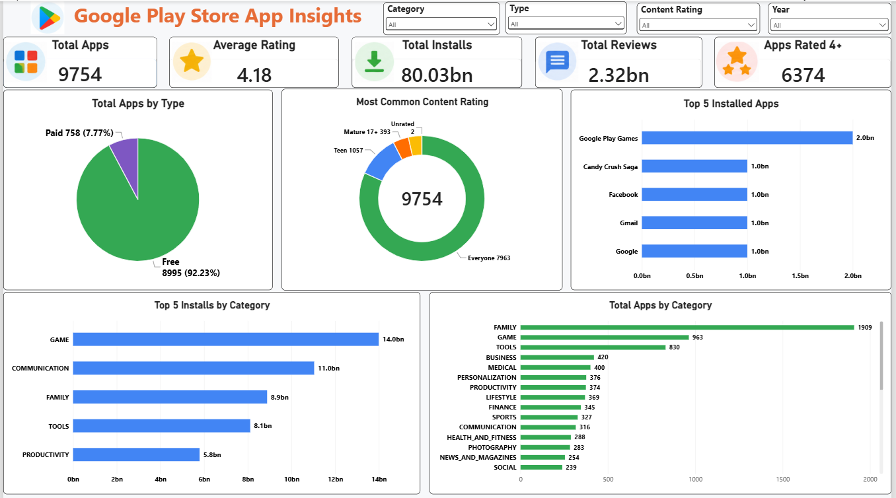
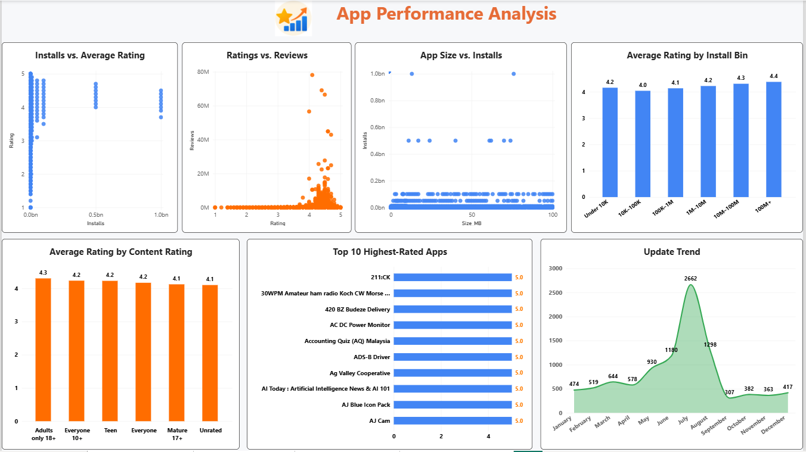
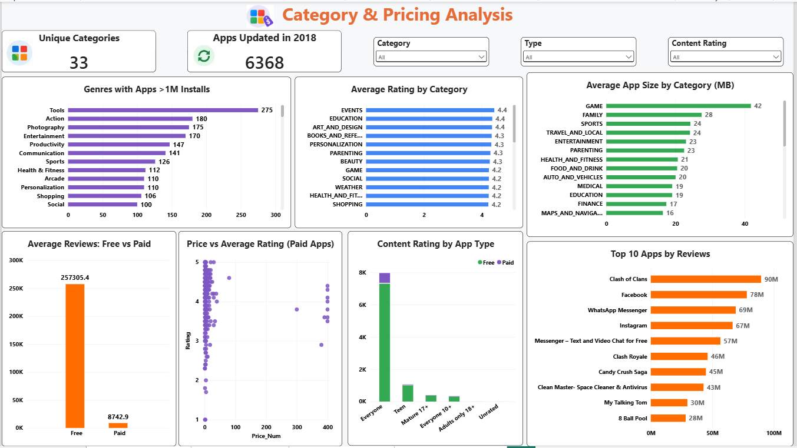
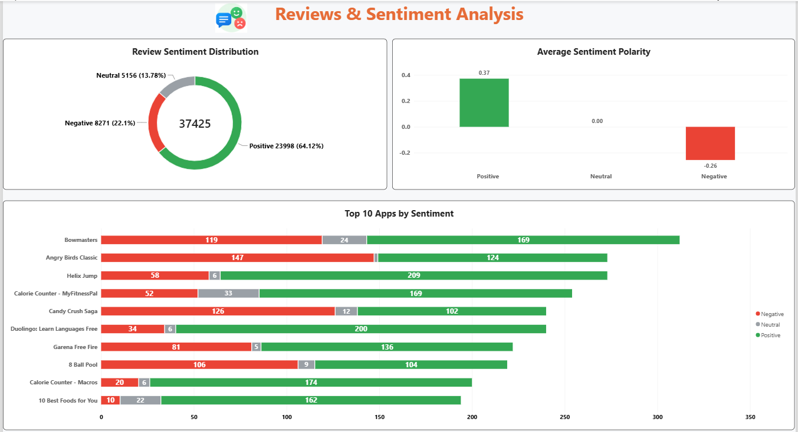
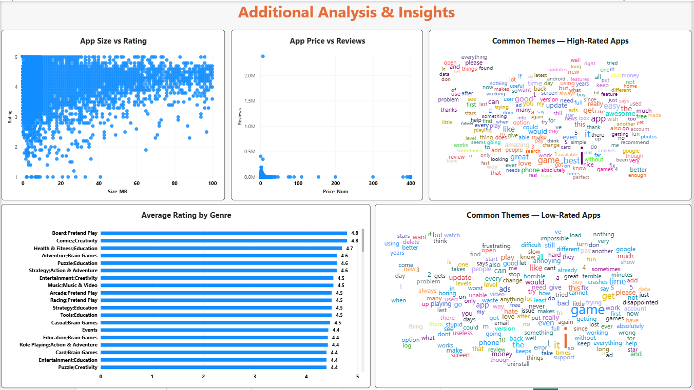

# Google Play Store App Insights

## 📊 Project Overview

This Power BI project analyzes Google Play Store app data to uncover patterns in app performance, ratings, installs, reviews, categories, pricing, and user sentiment.

The objective is to identify factors contributing to app success and generate actionable insights for app developers, product managers, marketing teams, and senior management.

## 🎯 Objectives

- Analyze factors contributing to app success.
- Identify high-performing app categories.
- Examine the relationship between ratings, reviews, and installs.
- Analyze the impact of app size on performance.
- Compare free and paid apps.
- Analyze pricing and user engagement.
- Understand content-rating and genre patterns.
- Analyze user review sentiment and common feedback patterns.

## 🛠️ Tools & Technologies

- Power BI
- Power Query
- DAX
- Data Cleaning & Transformation
- Data Visualization
- Sentiment Analysis

## 📑 Dashboard Pages

### 1. Executive Overview
Provides a high-level view of:
- Total apps
- Average rating
- Total installs
- Total reviews
- Free vs Paid apps
- App categories
- Content ratings
- Top installed apps and categories

### 2. App Performance
Analyzes:
- Installs vs Average Rating
- Ratings vs Reviews
- Top 10 highest-rated apps
- Rating by content rating
- App size vs installs
- Update trends
- Average rating by install range

### 3. Category & Pricing Analysis
Analyzes:
- App genres and installs
- Category ratings
- App size by category
- Free vs Paid reviews
- Price vs rating for paid apps
- Content rating by app type
- Top apps by reviews

### 4. Reviews & Sentiment Analysis
Analyzes:
- Review sentiment distribution
- Average sentiment polarity
- Top apps by sentiment
- Positive, neutral, and negative user feedback

### 5. Additional Analysis & Insights
Analyzes:
- Relationship between app size and ratings
- Relationship between app price and reviews for paid apps
- Average rating by genre
- Common themes in high-rated apps
- Common themes in low-rated apps

## 📸 Dashboard Preview

## 🔍 Key Insights

- The majority of apps are free, with paid apps representing a much smaller share.
- Apps with higher install volumes generally show strong average ratings.
- App update activity varies significantly across months.
- Larger install ranges tend to have strong average ratings.
- User reviews are predominantly positive.
- Positive sentiment has the highest average sentiment polarity.

## 📂 Dataset

The project uses Google Play Store app data along with Google Play Store user review data.

## 📌 Project Outcome

The dashboard provides an interactive view of Google Play Store app performance and user feedback, helping stakeholders identify trends and opportunities for improving app strategy, user experience, and market performance.
